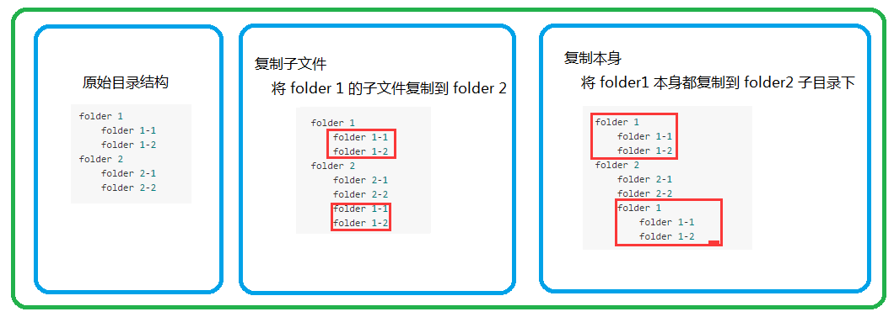

# dk-fs
对 node 提供的原生 fs 包进行扩展。


# 一、安装

`dk-fs` 为第三方包，使用前需要先进行安装。

```
$ npm install dk-fs
```

# 二、用法

```
// index.js
const fs2 = require('dk-fs');
const path = require('path');

const src = path.join(process.cwd(), 'package.json');
const dest = path.join(process.cwd(), 'demo');
fs2.copyFile(src, dest);
```

### 1. 复制文件

- `copyFile(src, dest, isreplace)`：复制文件，不光是文本文件，还可以复制图片，视频，压缩包等。
	
	- `src`源文件的绝对路径；
	- `dest` 目标文件夹的绝对路径；
	- `isreplace` 布尔值，如果目标地址已有源文件，是否替换，默认是替换的，想要不替换设置成 false。

### 2. 复制文件夹

- `copyDirSelf(src, dest)`：复制文件夹自身到目标文件夹。

    - `src` 源文件夹绝对路径；
    - `dest` 目标文件夹绝对路径。
    
- `copyDirChild(src, dest)`：复制源文件夹子文件到目标文件夹。

    - `src` 源文件夹绝对路径；
    - `dest` 目标文件夹绝对路径。
    
二者区别见下图：

```
原始目录结构                        复制子文件                                      复制本身
                    （将 folder 1 的子文件复制到 folder 2 下）        （将 folder 1 本身都复制到 folder 2 下）
                    
- folder 1                      - folder 1                                      - folder 1                    
    + folder 1-1                    + folder 1-1                                    + folder 1-1
    + folder 1-2                    + folder 1-2                                    + folder 1-2
- folder 2                      - folder 2                                      - folder 2
    + folder 2-1                    + folder 2-1                                    + folder 2-1    
    + folder 2-2                    + folder 2-2                                    + folder 2-2
                                    + folder 1-1                                    - folder 1
                                    + folder 1-2                                        + folder 1-1
                                                                                        + folder 1-2    
```



### 3. 删除文件夹

> fs 提供的 rmdir() 只能删除空文件夹，这里提供的几个方法不论文件夹内是否有子文件，一律删除，使用需谨慎。

- `delDirSelf(src)`：删除文件夹自身。

    - `src` 要删除的那个文件夹绝对路径。

- `delDirChild(src)`：删除文件夹的子目录，不包括自身。

    - `src` 要删除的那个文件夹绝对路径。
    
二者区别如下图：

```
原始目录结构                           删除文件夹（folder 2）子目录                      删除文件夹（folder 2）自身

- folder 1                          - folder 1                                      - folder 1    
    + folder 1-1                        + folder 1-1                                    + folder 1-1    
    + folder 1-2                        + folder 1-2                                    + folder 1-2
- folder 2                          + folder 2
    + folder 2-1
    + folder 2-2
```

### 4. 遇空则删
- `delEmpty(src)`：删除文件或文件夹，删除之后如果上一级目录的子目录为空，递归删除上一级直到子目录不为空。

    - `src` 要删除的那个文件或文件夹的绝对路径。 

该方法意思表示如下：

```
原始目录结构                            删除操作第一阶段                            删除操作第二阶段                    
                                    （删除 file 2-2-1 文件）                （file 2-2-1 父级目录 folder 2-2为空目录，删除）
                                                                （folder 2-2 父级目录 folder 2 下有 folder 2-1，不是空目录，删除操作停止）
                                                                
- folder 1                              - folder 1                                  - folder 1  
    + folder 1-1                            + folder 1-1                                + folder 1-1
    + folder 1-2                            + folder 1-2                                + folder 1-2
- folder 2                              - folder 2                                  - folder 2
    + folder 2-1                            + folder 2-1                                + folder 2-1
    - folder 2-2                            + folder 2-2
        + file 2-2-1
```


